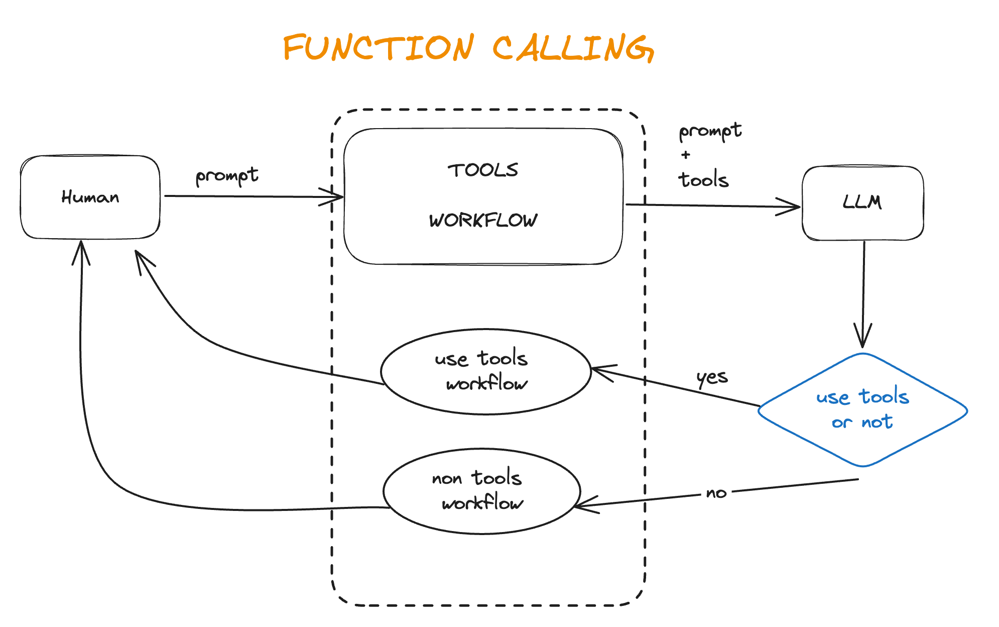

# Function calling 


## 1. 实现流程


## 2.环境安装
```
openai==0.28.1
streamlit==1.37.0

配置.env环境变量，将.env_sample重命命成.env
OPENAI_API_KEY=
AUTHORIZATION_CODE=
```

## 3. 项目执行
1. 终端
```
python app.py
```

2. 网页
```
streamlit run stapp.py
```

## 4. 参考链接

[126邮箱授权码获取](https://help.mail.163.com/faqDetail.do?code=d7a5dc8471cd0c0e8b4b8f4f8e49998b374173cfe9171305fa1ce630d7f67ac2a5feb28b66796d3b)

[openai官方示例](https://platform.openai.com/docs/guides/function-calling)


## 5. 思考

假设你要开发一款AI机器人（2D / 3D），这个机器人可以：
1. 对话
2. 有情感（喜怒哀乐）
3. 做对应动作
